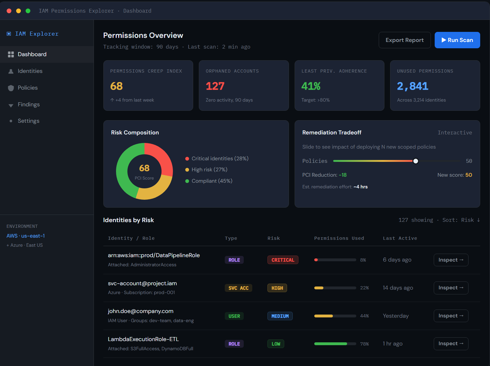
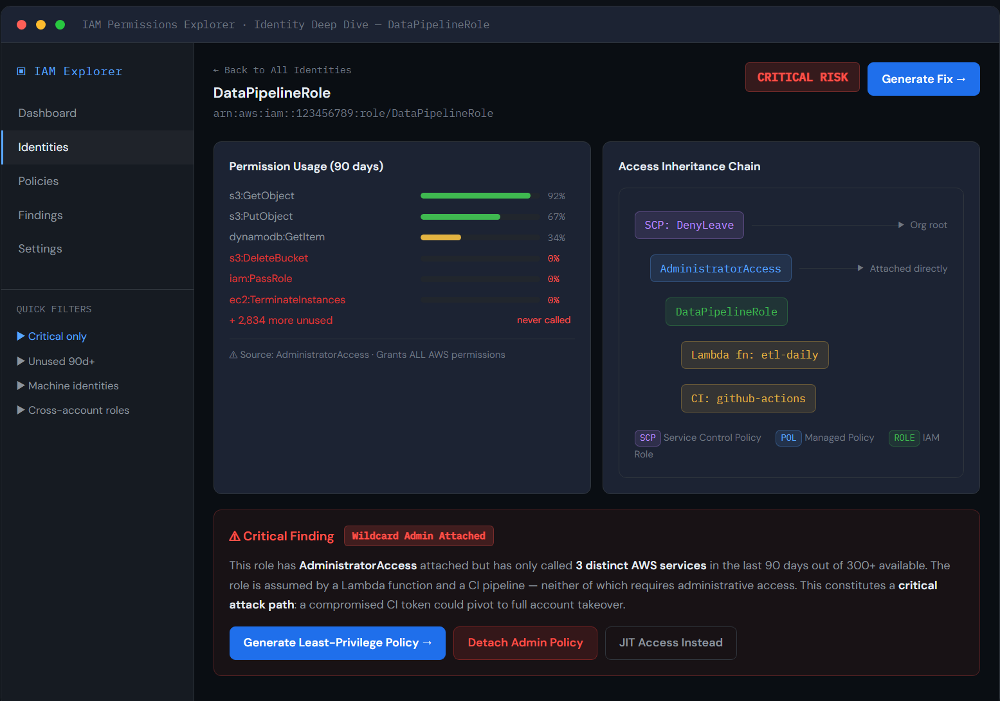
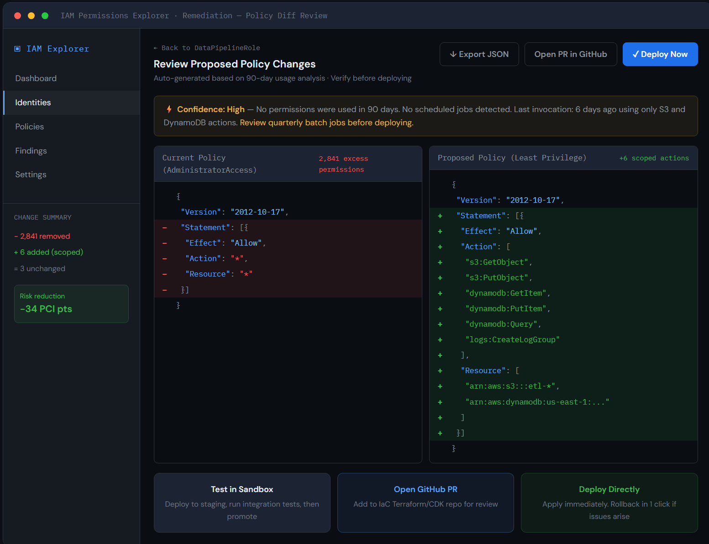

# IAM Permissions Explorer 
---

## What's in this repo

| File | Description |
|------|-------------|
| `design-doc.html` | Interactive design document — open in any browser |
| `assets/screen-1-dashboard.png` | Wireframe: Risk Dashboard |
| `assets/screen-2-deep-dive.png` | Wireframe: Identity Deep Dive |
| `assets/screen-3-diff.png` | Wireframe: Remediation Diff Viewer |

---

## How to view the design

Download `design-doc.html` and open it in any modern browser (Chrome, Firefox, Edge). No build step or dependencies required.

The document has five tabs:

1. **Problem Statement** — the core entitlement problem and why existing tools fail
2. **User Persona** — primary persona (Sarah Chen, Senior Cloud Security Engineer) and three pain points
3. **Wireframes** — three interactive screens with annotations (click between them)
4. **Features & KPIs** — prioritised feature list and success metrics table
5. **Dev Action Items** — five MVP engineering tasks with discussion points

---

## Wireframe Screens

### Screen 1 — Risk Dashboard

Entry point for every session. Shows the Permissions Creep Index (PCI), orphaned account count, least-privilege adherence score, and a sortable identity table with usage bars. Includes an interactive remediation tradeoff slider showing projected PCI reduction.

---

### Screen 2 — Identity Deep Dive

Drill-down view for a single identity. Shows per-action usage frequency bars for the 90-day window, a visual access inheritance chain (SCP → Policy → Role → Principals), and a plain-English critical finding summary with three remediation options.

---

### Screen 3 — Remediation Diff Viewer

Side-by-side JSON diff of the current wildcard policy versus the auto-generated least-privilege replacement. Includes a confidence signal banner, resource-scoped action list, and three deployment paths: sandbox test, GitHub PR, or direct deploy.

---

## Problem Summary

Cloud environments grant permissions far faster than they revoke them. Identities accumulate mostly-unused access over time, creating an attack surface that grows invisibly. The core challenge is a **gap analysis**: identifying the delta between what IAM policies allow and what telemetry logs show is actually used.

This is harder than it sounds due to:
- Taxonomical misalignment between IAM service prefixes and CloudTrail API prefixes
- Telemetry blind spots (data events off by default, some actions never logged)
- API versioning mutations that make log-to-policy matching non-trivial

---

## Design Approach

Rather than Figma static screens, this submission uses an **interactive HTML prototype**. This choice lets the wireframes include working navigation, real annotations, and live UI state — communicating design intent more precisely than screenshots alone.

Key original decisions:
- **Confidence signal over raw ML scores** — plain-English evidence summary instead of an opaque confidence number, directly addressing engineers' fear of breaking production
- **Three deployment paths** — sandbox, IaC PR, and direct deploy — meeting teams at different GitOps maturity levels rather than forcing a single workflow

